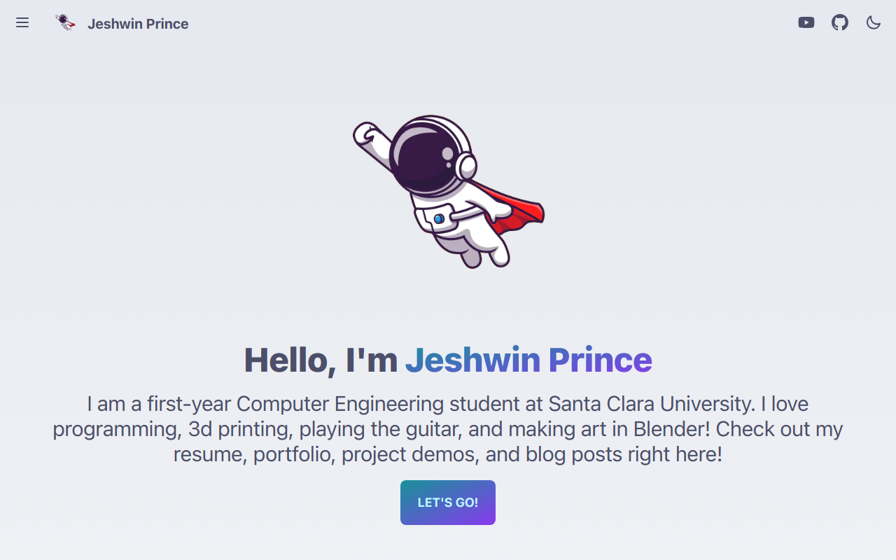

# Jeshwin Prince's Portfolio

Hello there! 👋 Welcome to my GitHub portfolio repository. This repository contains the source code for my personal portfolio website, showcasing my projects, skills, and achievements. The portfolio is built using Next.js, React, TypeScript, and Prisma, and is hosted on Vercel. It also utilizes AWS S3 for image hosting and PostgreSQL for the database.

## Technologies Used 🚀

-   [Next.js](https://nextjs.org/) - A React framework for building server-rendered and statically-generated websites.
-   [React](https://reactjs.org/) - A JavaScript library for building user interfaces.
-   [TypeScript](https://www.typescriptlang.org/) - A statically typed superset of JavaScript that enhances code quality and developer productivity.
-   [Prisma](https://www.prisma.io/) - A modern database toolkit and Object-Relational Mapping (ORM) tool.
-   [Vercel](https://vercel.com/) - A cloud platform for static sites and Serverless Functions, used for hosting the portfolio app.
-   [AWS S3](https://aws.amazon.com/s3/) - Amazon Simple Storage Service for hosting and serving images.
-   [PostgreSQL](https://www.postgresql.org/) - A powerful open-source relational database system.

## About Me 👨‍💻

I'm Jeshwin Prince, a passionate computer science undergraduate student with a love for creating innovative and user-friendly web applications. I enjoy working with cutting-edge technologies and turning ideas into reality through elegant and efficient code. This portfolio website is a testament to my skills, experience, and dedication.

## Features ✨

-   Showcase of my projects and case studies.
-   Detailed information about my skills and areas of expertise.
-   Contact information for potential collaborations and opportunities.
-   Seamless integration with my blog for sharing insights and knowledge.

## Getting Started 🛠️

To run this portfolio website locally, follow these steps:

1. Clone this repository: `git clone https://github.com/your-username/portfolio.git`
2. Navigate to the project directory: `cd portfolio`
3. Install dependencies: `pnpm install`
4. Set up environment variables for database connection, AWS S3, and other configurations.
5. Run the development server: `npm run dev`
6. Open your browser and visit: `http://localhost:3000`

Feel free to explore the code, customize the content, and make it your own!

You can also peruse my portfolio website at [jeshw.in](https://www.jeshw.in)!

## Contact Me 📬

I'm always excited to connect with fellow developers, potential clients, or anyone interested in technology. If you have any questions, suggestions, or just want to say hi, feel free to reach out to me at [jeshwinjprince@gmail.com](mailto:jeshwinjprince@gmail.com).

Let's build amazing things together! 🌟
