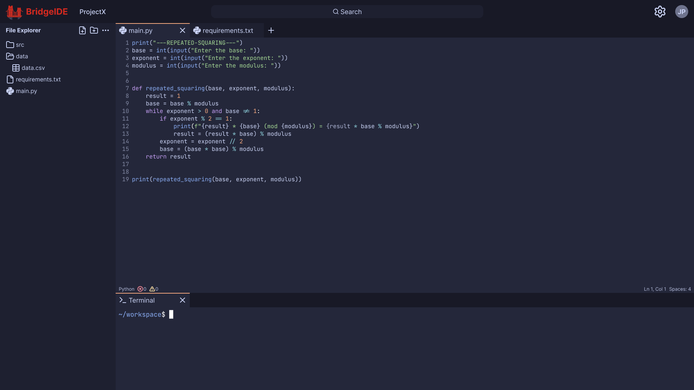
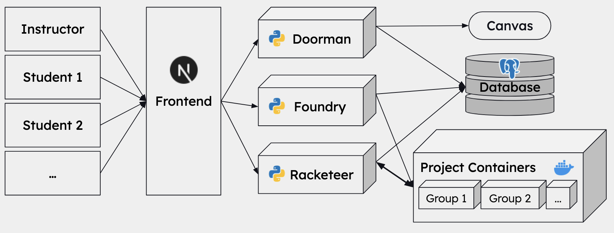
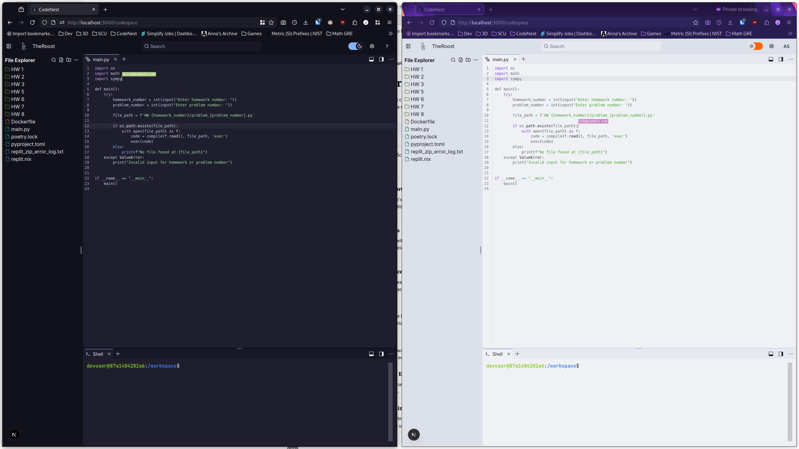
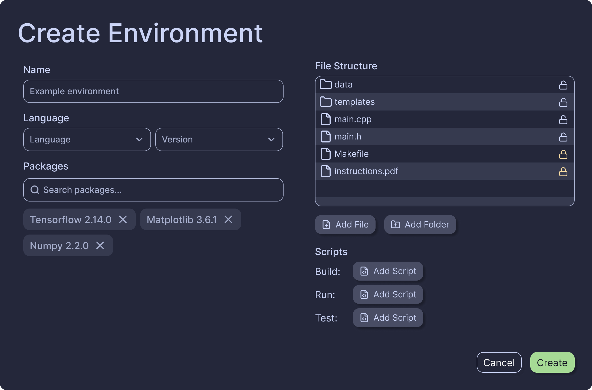

# What was BridgeIDE?

## The Beginning

BridgeIDE started off as a personal project among friends. One day, my friend Ethan asked me if he wanted to work together on a project we could put on our resume and talk about with recruiters. A few days later, over lunch, I proposed three ideas. One was a website to slice and manage 3D prints, similar to [AstroPrint](https://www.astroprint.com/), because I was really interested in 3D printing at the time. I had another idea, but it was so lackluster I've forgotten. But the third project idea clicked almost instantly with us. It was a coding environment running on the browser, just like [VS Code Web](https://code.visualstudio.com/docs/remote/vscode-web) and [Replit](https://replit.com/) (before they went all-in on vibe coding slop). The key innovation we wanted to add that would make the app really stand out was real-time collaboration. Although this is a feature that already existed on Replit and can be added to local IDEs through extensions like [Live Share](https://visualstudio.microsoft.com/services/live-share/), we hoped that our project would help us understand how these features work, and show others that we could contribute to similarly complex features in the future. However, this first version of the project _wasn't_ BridgeIDE!

## CodeNest

We named this personal project [CodeNest](https://www.codenest.space/), because ~~ChatGPT came up with a good name~~ it's like a nest for your code. We started development during my sophomore year at SCU, and continued until summer of junior year. When we initially started the project. We treated this project as if it was for a class, working on our system design and frontend sketches in between studying for linear algebra and circuits. Figuring out the best way to run the code that users would write in CodeNest was the hardest problem we had to solve, but it was the most rewarding experience of the whole project. It taught me the importance of system design and planning before development.

In order to display the editor, file explorer, and terminal all on the same page, similar to VS Code's panel system and Replit's pane system, my work on CodeNest spawned a new project I called [react-layman](https://www.npmjs.com/package/react-layman). The goal of react-layman was to create a component library for tiling windows and tabs, supporting drag and drop, split views, and floating windows. I plan to post a more technical write-up about how react-layman works, because it taught me a lot about niche TypeScript and React features that I'd have experience with otherwise.

I distinctly remember one day I was drawing out a system diagram for CodeNest using Kubernetes for my friends Ethan and Arnav, and we spent 20 minutes planning out how to package user-generated code into pods, programmatically scale and distribute workloads, and connect the user-facing website to the correct pod in real-time using WebSockets. I felt like I was prepping for an interview!

What made CodeNest so special to me wasn't just the uniqueness of the project, but the experience of working as a team to solve complex problems, design our solution, and actually implement it into the real world. It was an experience I'll never forgot. But how did CodeNest ultimately become BridgeIDE?

## Senior Design Project

In order to graduate from Santa Clara University, all students in the School of Engineering must complete a senior design capstone project and present it at the annual Senior Design Conference. While many students work on research projects already owned by faculty at SCU, my team and I decided to create our own proposal and connect with faculty that were interested in mentoring our project. Since I already had a small version of CodeNest deployed at the time, we decided to extend the scope of CodeNest to target an educational audience.

Although Ethan moved on to bigger and better things (leaving SCU to finish his CS degree at UC Irvine), Arnav and I, along with our friends Will and Maya, pitched BridgeIDE to professors as a cloud-based collaborative IDE built specifically for computer science students and educators. It would provide pre-configured, course-ready environments that run entirely in the browser, allowing users to code,
compile, and execute assignments instantly, without downloading or setting up environments locally. Teams can collaborate in real time, view each other’s changes, and communicate seamlessly without worrying about local configurations or repository management. Professors can also deploy starter code or lab templates to entire classes in seconds, dramatically reducing administrative overhead. Unlike prior solutions, our platform enables immediate participation, fosters meaningful collaboration, and encourages skill development in teamwork and communication, bridging the gap between class work and real-world software development experience.

# How we Made it

Creating BridgeIDE was easier said than done, even with the foundation that was CodeNest. The three main legs of our process were design, development, and deployment, and each phase came with its own social and technological challenges.

## 1. Design

When divvying up the working during fall quarter, we ended up having two people design the frontend and two people design the backend system architecture.

I was first on the frontend team, using [Figma](https://www.figma.com/) to create sketches of our website and what pages we needed for an MVP. I had a lot of fun trying different fonts, color schemes, and layouts, until I landed on something like this:

You may be wondering, "Weren't two people working on the frontend design? What did you other teammate do?" Well, they decided to try and AI-generate the frontend using Figma's built in AI tools, not realizing they were a paid feature, and costing the seat owner (me) $20 per month. It wasn't until I received a random invoice from Figma in February of this year that I realized what had happened! Fortunately, I was able to cancel the subscription and finalize my hand-crafted design, but I did not appreciate this un-collaborative situation. Going forward, we all made better efforts to work together and keep each other informed on our tasks, rather than just working independently.

Since the frontend design was finalized much quicker than we planned, all four of us worked together to finalize the back-end design. By the end of the fall quarter, we decided on a microservice-based architecture, using [Docker](https://www.docker.com/) containers to not only execute user-generated code on the cloud, but also host all the services for our app. We split our app's core functionality into three services that we lovingly nicknamed: Doorman, our authentication and authorization service; Foundry, our project template generator service; and Racketeer, our project-user connector service. Here is our final system architecture diagram:

## 2. Development

### Doorman

You'll notice in the system diagram that Doorman communicates with Canvas as the source of truth for user authorization, verifying if a user is a student or instructor for a certain class and which projects they have been assigned. Unfortunately, we weren't able to get permission to directly communicate with SCU's actual Canvas instance. Therefore, in order to make progress in development, we decided to host our own Canvas instance on EC2, to show the university and others that our project could easily integrate into any organization that uses Canvas for their courses. While this sounded simple in theory, it became a real painpoint for our development journey, as we added an entirely new feature to maintain and connect to our existing system. Arnav was crucial in making this work, as he had take the responsibility of both hosting the Canvas instance, developing the Doorman microservice, and managing the SQL database schemas so that the other microservices could easily access the authorization data. I truly respect the hard work and dedication he put into both CodeNest and BridgeIDE, and I am thankful that he was a part of this team!

### Racketeer

Racketeer was most likely the largest component of BridgeIDE, second only to the front-end. Not only did the service need to create and manage new containers for student projects, it also handled real-time communication between the container and multiple students updating and running the code in real time! Even starting with CodeNest's implementation, which supported a single user-project connection, we had to extend the system to support project creation, multi-user support, and container lifecycle management.

Project creation and container management were actually the most straight-forward features to implement, since we could give Racketeer access to the parent Docker service by mounting the `/var/run/docker.sock` file, which holds the Unix socket of the parent's docker daemon. Of course, this was a relatively hacky solution that relied on both the micro-services and project-generated containers running on the same machine. While this solution would not have scaled in a more realistic deployment, with potentially thousands of students concurrently creating and connecting to their projects, it worked for the purposes of our proof-of-concept to the university. If I were to continue working on BridgeIDE in a more professional capacity (which I am open to doing), I would consider a more scalable deployment strategy using tools I have become more familiar with, such as [Kubernetes](https://kubernetes.io/) and [Helm](https://helm.sh/).

For the real-time multi-user support, I extensively researched how existing apps, such as Google Docs and Replit, implement this feature. While the real-time two-way communication between users and their projects could be implemented using WebSockets, the biggest problem that needed to be solved with implementing this feature was making sure the codebase stayed consistent across multiple users as incoming changes could be received out-of-order. There are two existing solutions based on my research, [Operational Transformations (OT)](https://en.wikipedia.org/wiki/Operational_transformation) and [Conflict-free Replicated Data Types (CRDT)](https://en.wikipedia.org/wiki/Conflict-free_replicated_data_type). While CRDT _can_ be used to power a collaborative text editor through packages such as [Yjs](https://docs.yjs.dev/), we found OT to be easier to implement and extend to include features such as real-time cursors and highlighting.

I remember working through the evening with Will trying to make the multi-user feature work. After 5 hours and a dinner break, we had a basic schema for sending updates across the WebSocket connection, but we weren't able to get two users to have a synced state. After we ended for the day and went back home, I stayed up until midnight working on the feature until I sent the team a screenshot of it finally working!

### Foundry

Foundry was the simplest service to implement, since we just had to give it access to the parent Docker process just like we did with Racketeer, but instead use it to generate Docker images out of an environment creation form that instructors could access through our app. Just like Racketeer, this is a hacky and definitely unsafe way of handling user-generated container images, and I would definitely consider using a more robust solution from the Kubernetes ecosystem that already supports sandboxing, autoscaling, and retry logic.

## 3. Deployment

Ignoring our self-hosted Canvas instance, deployment was the easiest part of making BridgeIDE. Since we didn't have to worry about scalability to make a presentable project, we put all the containers on a single EC2 instance running Docker, and only started the instance when testing and showing the app in the showcase in order to mitigate costs.

Of course, for a real product, we would consider scalability to be equally important to our functionality. We did discuss how our solution could be scaled vertically by increasing the EC2 instance's resources, but we also argued that our services could theoretically be scaled horizontally as well, since the container images were already built and ready to be stored in a registry for use in a Kubernetes cluster.

# Presenting our Project

# Final Thoughts
